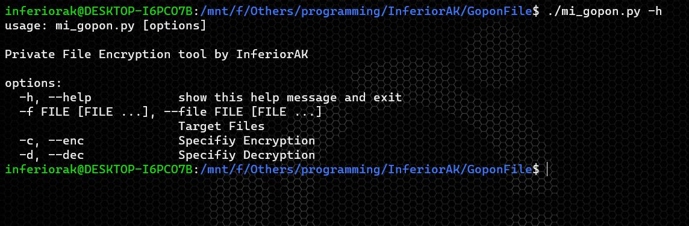
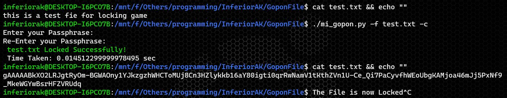
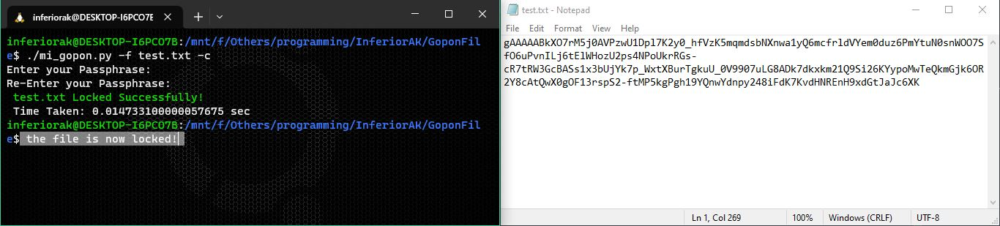

# GoponFIle
<b>GoponFile is a Simple File Locker based on Python. It's Safe and User Friendly to use. So Let's try it and Enjoy!</b>

  
  
  
  
  

  
  
  </a>

Tutorial : <a href="#" target=_blank><b>**Click**</b></a>

 

## [*] Supports on
- Android
- Linux
- Windows
> Everywhere that supports Python3
  
## [*] Features
<b>
+ Locking Private Files 
+ Also Unlocking 
+ Easy to Use 
</b>
 
  
## Installations and Overview
> At first You have to install python3 on your system
  
> Now write these commands :
- ` git install https://github.com/InferiorAK/GoponFIle `  
- ` cd GoponFile `
  > For Linux
  
- ` ./mi_gopon.py -h `
  > For Windows
- ` python3 mi_gopon.py -h `
  
  > **Output**:
  

 
  
  > **To Lock File**:
  
- ` python3 mi_gopon.py -f file_path -c `

 

