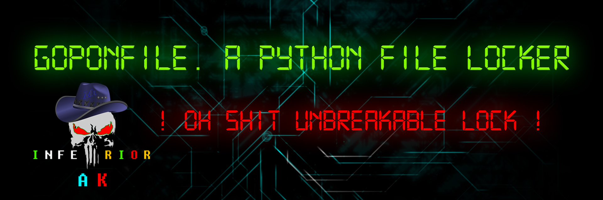
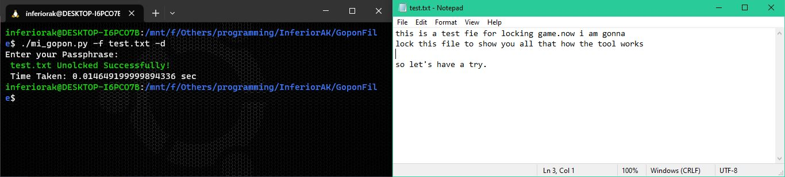

# GoponFile
<b>GoponFile is a Simple File Locker based on Python. It's Safe and User Friendly to use. So Let's try it and Enjoy!</b>



<p align="center">
  
  
  
  
  
</p>

<p align="center">
  
  
  </a>
</p>
<p align=center>Tutorial : <a href="https://youtu.be/urI8_h8Q3iE" target=_blank><b>**Click**</b></a><p>
<br>

## [*] Supports on
- Android
- Linux
- Windows
> Everywhere that supports Python3
  
## [*] Features
<b>
+ Locking Private Files<br>
+ Also Unlocking<br>
+ Easy to Use<br>
</b>
<br>
  
## Installations and Overview
> At first You have to install python3 on your system
  
> Now write these commands :
- ` git clone https://github.com/InferiorAK/GoponFIle ` <br>
- ` cd GoponFile `
- ` pip3 install -r requirements.txt `
  > For Linux
  
- ` ./mi_gopon.py -h `
  > For Windows
- ` python3 mi_gopon.py -h `
  
> **Output**:
  

<br>
  
> **To Lock File**:
  
- ` python3 mi_gopon.py -f file_path -c `


  
  > **To Lock Multiple Files**:

- ` python3 mi_gopon.py -f file1 file2 file3 file4 .... -c `
  
<br><br>
  
> **To Unlock File**:
  
- ` python3 mi_gopon.py -f file_path -d `

  
  > **To Unlock Multiple Files**:

- ` python3 mi_gopon.py -f file1 file2 file3 file4 .... -d `


```
usage: mi_gopon.py [options]

Private File Encryption tool by InferiorAK

options:
  -h, --help            show this help message and exit
  -f FILE [FILE ...], --file FILE [FILE ...]
                        Target Files
  -c, --enc             Specifiy Encryption
  -d, --dec             Specifiy Decryption
  
```
  
> Now Enjoy! And don't forget to follow me and Subscribe my Youtube Channel

> <b>**`Note:`</b> Don't Misuse or Sell my Codes. If you want then you can learn from it but If you want to modify my Codes, Then Give me The Credits. Don't Copy it same to same with your name. <br>---Thank You---
  
## [*] Contact :
[](https://github.com/InferiorAK)
[](https://www.facebook.com/InferiorAK)
[](https://m.me/InferiorAK)
[](https://www.twitter.com/InferiorAK)
  
